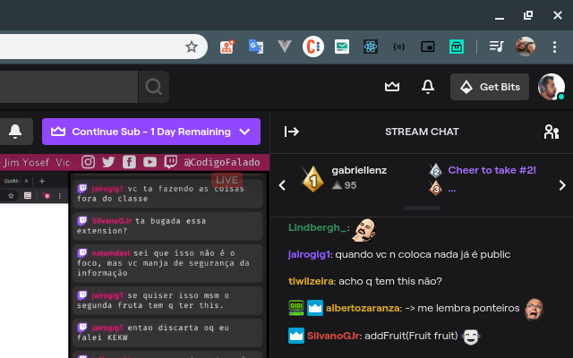

Auto Redeem Twitch Bonus
========================

Add Auto Redeem Twitch Bonus to your pull requests and comments on GitHub!

* [Get it now on the Chrome Web Store!](https://chrome.google.com/webstore/detail/auto-redeem-twitch-bonus/leheoeognmlgfdljnhckphighdlpnpnd)

## Developing

First, clone this repository: `git clone https://github.com/alexandreramosdev/auto-reddem-twitch-bonus`. Then follow the instructions for your given platform. For convenience, you can run `./build.sh` to build and package the Chrome.

### Chrome

1. Enable [Chrome Extensions Developer Mode](https://developer.chrome.com/extensions/faq#faq-dev-01) in Chrome.
2. In Settings > Extensions click *"Load unpacked extension"* and select the `chrome/` subfolder of this repository.

## Awesome contributors

This project is much better now than it was at launch thanks to these people.

Awesome | Avatar
--------|--------
[Alexandre Ramos](https://github.com/alexandreramosdev) |
 

